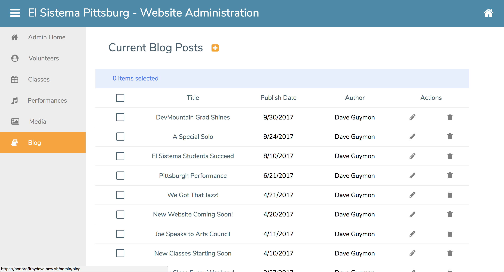
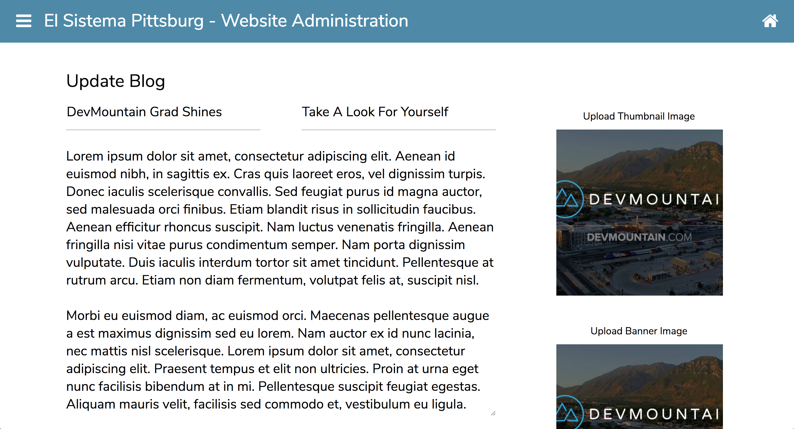
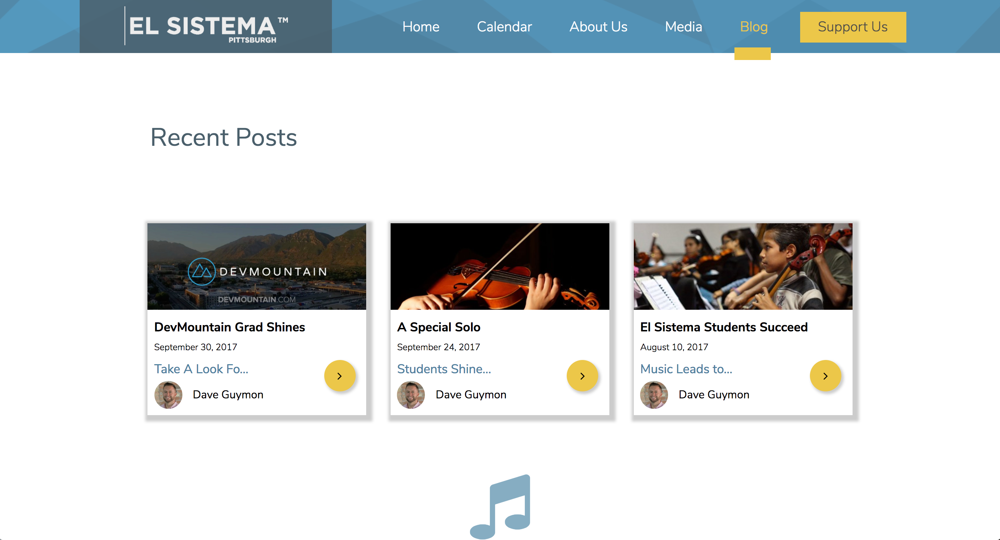

OVERVIEW

<a href="https://nonprofitbydave.now.sh">This non-profit site upgrade</a> is a group project, on which I served as the lead front-end developer. On this project, I worked heavily with React and Redux, JavaScript, and HTML5 and CSS3 utilizing media queries to ensure this single-page application is both beautiful and functional on various desktop, tablet, and smartphone interfaces.

I also lent my support to the back-end team, where I interacted with our database through creating multiple SQL queries, building several Node endpoints, and both setting up and testing a number of AJAX requests that enabled working back and forth with data between the back- and front-ends.

MAJOR TECHNOLOGIES

  <ul>
    <li>React with Redux</li>
    <li>JavaScript (ES6)</li>
    <li>CSS3 with Flexbox & Media Queries</li>
    <li>RESTful API requests</li>
    <li>Node</li>
    <li>Express</li>
    <li>Massive</li>
    <li>PostgreSQL</li>
    <li>Auth-0</li>
    <li>Amazon S3</li>
    <li>Stripe</li>
  </ul>

  

FULLY-FUNCTIONAL BLOG WITH ADMIN PORTAL

In additional to styling, I was also responsible for coding all of the blog functionality in both the public- and admin-portals. To access the admin portal, user-authentication was incorporated using Auth-0. From tracking current blog posts, to adding or updating fresh new content (including images and videos from Amazon S3), El Sistema site administrators will now be able to provide their site users with the messaging and media that will mean the most to them.

CONTENT CREATED IN ADMIN PORTAL RENDERS IN PUBLIC VIEWS

Once published, an admin user can click on the home icon to navigate back to the public interface, head over to the blog component, and see their newly created entry displayed as a blog teaser under recent posts.

Now, anyone visiting the upgraded El Sistema Pittsburgh site can find this teaser and click on it to view all blog post content.

DISCLAIMER

TheNorthFaceByDave is a non-commercial personal project meant to be a prototype for future non-profit solutions. This project was used to develop and demonstrate full-stack concepts using responsive-design created in a group dynamic.
